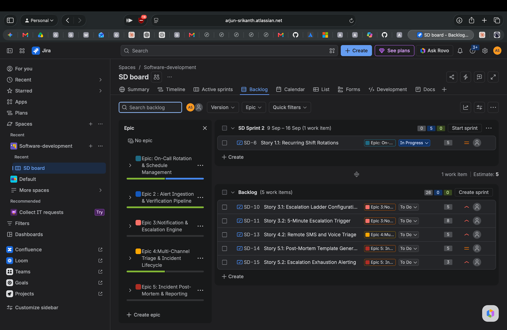
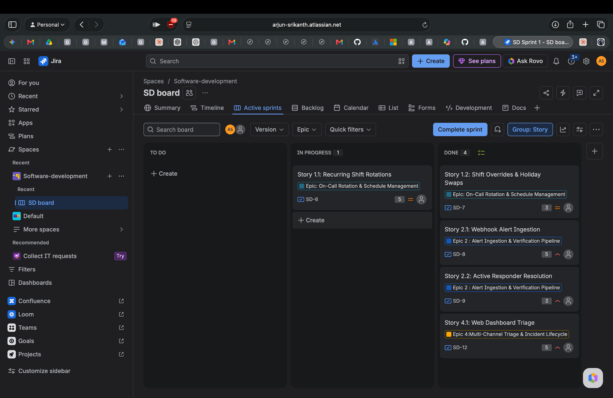
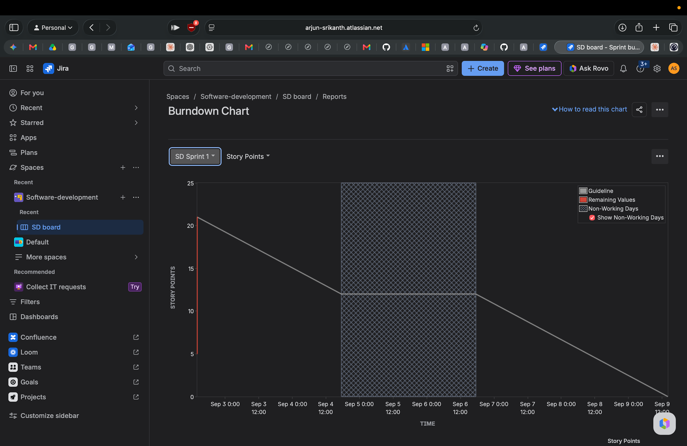

# Department of Computer Science & Engineering
## PES University, Bengaluru
### Software Engineering Lab (SE Lab) — Lab 2 Report
**Agile Backlog Creation & Sprint Simulation in Jira**

---

### Student Information
* **Name**: Arjun Srikanth
* **SRN**: PES1UG24AM920
* **Problem Statement**: #48 — Incident Escalation & On-Call Rotation Engine
* **GitHub Repository**: [github.com/arjunsrikanthh/PES1UG24AM920_se_lab](https://github.com/arjunsrikanthh/PES1UG24AM920_se_lab)
* **Jira Workspace**: `arjun-srikanth.atlassian.net` (Project: **Software-development** / **SD board**)

---

## 1. Backlog, Epics & Story Point Assignments

Functional requirements from Lab 1 were decomposed into five major Epics and prioritized User Stories in Jira. Effort estimation was conducted using Planning Poker based on the Fibonacci scale ($1, 2, 3, 5, 8$):

### Epics & User Stories Breakdown

| Epic | Issue Key | User Story Title | Story Points | Priority | Description / Scope |
| :--- | :--- | :--- | :---: | :---: | :--- |
| **Epic 1: On-Call Rotation & Schedule Management** | **SD-6** | Story 1.1: Recurring Shift Rotations | 5 | Medium | Recurring shift configuration, primary/secondary engineer assignment, automated rotation cycle. |
| | **SD-7** | Story 1.2: Shift Overrides & Holiday Swaps | 3 | Medium | Manual overrides for leaves/holidays, shift swapping, temporary reassignment logic. |
| **Epic 2: Alert Ingestion & Verification Pipeline** | **SD-8** | Story 2.1: Webhook Alert Ingestion | 5 | High | Ingesting alerts from external monitoring sources via webhook payload validation. |
| | **SD-9** | Story 2.2: Active Responder Resolution | 3 | High | Dynamic lookup of active on-call engineer from rotation schedule at alert timestamp. |
| **Epic 3: Notification & Escalation Engine** | **SD-10** | Story 3.1: Escalation Ladder Configuration | 5 | High | Configurable multi-tier escalation policy definitions and tier timeouts. |
| | **SD-11** | Story 3.2: 5-Minute Escalation Trigger | 8 | High | Automated timeout trigger escalating unacknowledged P1 incidents to tier-2 engineers. |
| **Epic 4: Multi-Channel Triage & Incident Lifecycle** | **SD-12** | Story 4.1: Web Dashboard Triage | 5 | High | Web UI for incident acknowledgement, reassignments, notes, and resolution status changes. |
| | **SD-13** | Story 4.2: Remote SMS and Voice Triage | 5 | High | Out-of-band response capabilities (SMS replies, automated voice call DTMF keypress). |
| **Epic 5: Incident Post-Mortem & Reporting** | **SD-14** | Story 5.1: Post-Mortem Template Generation | 5 | Medium | Automated timeline generation, root cause analysis fields, and post-incident review records. |
| | **SD-15** | Story 5.2: Escalation Exhaustion Alerting | 3 | Medium | Fallback notification and broadcast when all escalation ladder tiers fail to acknowledge. |

---

### Deliverable Screenshot 1: Backlog with Epics & Story Point Assignments

*Figure 1: Backlog view in Jira showing Epics, User Stories, and Story Point estimates.*

---

## 2. Sprint Board (Active Sprint View)

For the sprint simulation, **SD Sprint 1** was created with a **1-week timebox**. Five user stories totaling **21 story points** were committed (`SD-6`, `SD-7`, `SD-8`, `SD-9`, `SD-12`). Work items were progressed across **To Do**, **In Progress**, and **Done**:

### Sprint Execution Breakdown

* **Completed Items (16 Story Points):**
  * `SD-7`: **Shift Overrides & Holiday Swaps** (3 pts) — Moved to **Done**
  * `SD-8`: **Webhook Alert Ingestion** (5 pts) — Moved to **Done**
  * `SD-9`: **Active Responder Resolution** (3 pts) — Moved to **Done**
  * `SD-12`: **Web Dashboard Triage** (5 pts) — Moved to **Done**

* **In-Progress Item (5 Story Points):**
  * `SD-6`: **Recurring Shift Rotations** (5 pts) — **In Progress** at sprint closure; carried over to **SD Sprint 2** (9 Sep – 16 Sep).

---

### Deliverable Screenshot 2: Active Sprint Board

*Figure 2: Active Sprint board for SD Sprint 1 showing In Progress and Done work items.*

---

## 3. Burndown Chart & Sprint Progress

The burndown chart tracks story point completion relative to the linear guideline:

* **Initial commitment**: 21 story points at sprint start (2:02 PM).
* **Burned down**: 16 points completed across `SD-7`, `SD-8`, `SD-9`, and `SD-12` (2:03 PM).
* **Remaining**: 5 points (`SD-6`) at sprint closure (2:05 PM).
* **Delivered velocity for SD Sprint 1**: 16 story points.

---

### Deliverable Screenshot 3: Burndown Chart

*Figure 3: Burndown Chart for SD Sprint 1 showing story points completed versus the guideline.*

---

## 4. Answers to Reflection Questions

### Question 1: Did your estimations reflect the actual effort?
The Fibonacci estimates accurately reflected the relative differences in complexity across most stories. Straightforward tasks like responder lookup (`SD-9`, 3 points) and shift overrides (`SD-7`, 3 points) were completed smoothly. However, `SD-6` (*Recurring Shift Rotations*, estimated at 5 points) took longer than expected due to complex scheduling math and edge cases, remaining in progress at sprint completion. This indicates that recurring schedule logic carried higher uncertainty and should have been sized at 8 points or split into smaller stories.

### Question 2: Was your backlog well-prioritized?
**Yes.** The backlog was prioritized strictly by functional dependency and operational risk. Ingestion (**Epic 2**) and rotation scheduling (**Epic 1**) formed the foundation required for alert dispatch. Web triage (`SD-12`) was included to provide immediate end-to-end visibility. Dependent features such as automated multi-tier escalation triggers (**Epic 3**), remote voice/SMS triage (**Epic 4**), and post-mortem reporting (**Epic 5**) were properly deferred to future sprints.

### Question 3: How did your simulated sprint align with your plan?
The team planned **21 story points** and delivered **16 story points** (4 out of 5 stories completed, representing a **76.2% completion rate**). The simulation demonstrated realistic Scrum dynamics: rather than rushing or partially accepting an incomplete feature, `SD-6` was cleanly kept in progress and rolled over into Sprint 2.

### Question 4: What insights did the burndown chart give about your team's capacity?
The burndown chart showed that the team's sustainable velocity for a 1-week sprint is approximately **16 story points**. Committing 21 points exceeded team capacity. For future sprint planning (such as SD Sprint 2), **15–16 story points** will serve as a grounded capacity baseline. Furthermore, the sharp drops in the burndown curve reflect batch completion during the simulation, reinforcing the need for continuous daily task updates in actual engineering workflows.
